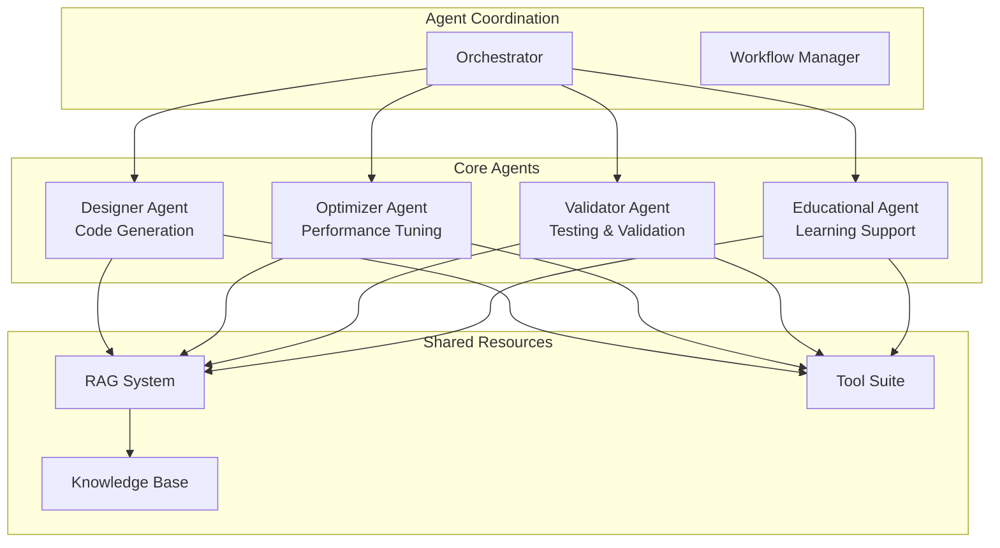

# Agent System Documentation

## 🤖 Multi-Agent Architecture Overview

The Cirq-RAG-Code-Assistant employs a sophisticated multi-agent system where specialized agents collaborate to generate, optimize, validate, and explain quantum computing code. Each agent has distinct responsibilities and expertise areas.

## 🏗️ Agent Architecture



## 🎯 Agent Responsibilities

### 1. Designer Agent
**Primary Role**: Code Generation and Structure Design

**Responsibilities**:
- Parse natural language descriptions
- Generate initial Cirq code structure
- Apply Cirq best practices and patterns
- Handle algorithm-specific implementations
- Create modular, reusable code components

**Key Capabilities**:
- Natural language understanding
- Code template selection and customization
- Algorithm pattern recognition
- Import management and dependency resolution

### 2. Optimizer Agent
**Primary Role**: Performance Optimization and Efficiency

**Responsibilities**:
- Analyze circuit performance metrics
- Apply optimization rules and transformations
- Reduce gate count and circuit depth
- Optimize for specific quantum hardware
- Balance performance vs. accuracy trade-offs

**Key Capabilities**:
- Circuit analysis and profiling
- Gate reduction techniques
- Depth optimization algorithms
- Hardware-specific optimizations
- Performance benchmarking

### 3. Validator Agent
**Primary Role**: Testing, Validation, and Quality Assurance

**Responsibilities**:
- Syntax validation and error checking
- Compilation testing and dependency verification
- Simulation execution and result validation
- Performance testing and benchmarking
- Error reporting and debugging assistance

**Key Capabilities**:
- Real-time code compilation
- Quantum circuit simulation
- Test case generation and execution
- Error detection and diagnosis
- Performance measurement

### 4. Educational Agent
**Primary Role**: Learning Support and Knowledge Transfer

**Responsibilities**:
- Generate step-by-step explanations
- Create visual representations of circuits
- Provide learning materials and resources
- Explain quantum concepts and principles
- Support different learning styles and levels

**Key Capabilities**:
- Natural language explanation generation
- Circuit visualization and diagramming
- Educational content creation
- Learning path recommendations
- Interactive tutorial generation

## 🔄 Agent Workflow

### Standard Workflow
```mermaid
sequenceDiagram
    participant U as User
    participant O as Orchestrator
    participant D as Designer
    participant R as RAG System
    participant V as Validator
    participant E as Educational
    participant Opt as Optimizer
    
    U->>O: "Create a VQE circuit for H2 molecule"
    O->>D: Generate initial code
    D->>R: Retrieve VQE examples
    R-->>D: Relevant patterns and templates
    D-->>O: Initial code structure
    O->>V: Validate generated code
    V-->>O: Validation results
    O->>Opt: Optimize circuit
    Opt-->>O: Optimized code
    O->>E: Generate explanations
    E-->>O: Educational content
    O-->>U: Complete response with code and explanations
```

### Iterative Improvement Workflow
```mermaid
sequenceDiagram
    participant O as Orchestrator
    participant D as Designer
    participant V as Validator
    participant Opt as Optimizer
    
    O->>D: Generate code
    D-->>O: Initial code
    O->>V: Validate
    V-->>O: Issues found
    O->>D: Fix issues
    D-->>O: Updated code
    O->>V: Re-validate
    V-->>O: Validation passed
    O->>Opt: Optimize
    Opt-->>O: Final optimized code
```

## 🛠️ Agent Communication

### Message Types
```python
class AgentMessage:
    """Base message class for agent communication."""
    
    def __init__(self, message_type: str, content: dict, sender: str, recipient: str):
        self.message_type = message_type
        self.content = content
        self.sender = sender
        self.recipient = recipient
        self.timestamp = datetime.now()
        self.message_id = str(uuid.uuid4())

class CodeGenerationRequest(AgentMessage):
    """Request for code generation."""
    pass

class ValidationRequest(AgentMessage):
    """Request for code validation."""
    pass

class OptimizationRequest(AgentMessage):
    """Request for code optimization."""
    pass

class EducationalRequest(AgentMessage):
    """Request for educational content."""
    pass
```

### Communication Patterns
- **Request-Response**: Synchronous communication for immediate results
- **Event-Driven**: Asynchronous communication for long-running tasks
- **Broadcast**: One-to-many communication for notifications
- **Pipeline**: Sequential processing through multiple agents

## 🧠 Agent Intelligence

### Knowledge Sharing
- **Shared Context**: Common context object accessible by all agents
- **Experience Database**: Learning from previous interactions
- **Pattern Recognition**: Identifying common problems and solutions
- **Collaborative Learning**: Agents learn from each other's successes

### Decision Making
- **Rule-Based Logic**: Predefined rules for common scenarios
- **Machine Learning**: Adaptive behavior based on experience
- **Heuristic Algorithms**: Domain-specific optimization strategies
- **Fallback Mechanisms**: Graceful handling of edge cases

## 📊 Agent Performance Metrics

### Designer Agent Metrics
- **Code Generation Accuracy**: Percentage of syntactically correct code
- **Algorithm Coverage**: Number of supported quantum algorithms
- **Template Utilization**: Effectiveness of code templates
- **User Satisfaction**: Ratings for generated code quality

### Optimizer Agent Metrics
- **Optimization Effectiveness**: Average improvement in circuit metrics
- **Performance Gain**: Reduction in gate count and depth
- **Hardware Compatibility**: Success rate on different quantum devices
- **Optimization Speed**: Time required for optimization

### Validator Agent Metrics
- **Validation Accuracy**: Correct identification of code issues
- **Test Coverage**: Percentage of code paths tested
- **Error Detection Rate**: Success in finding bugs and issues
- **Simulation Success**: Percentage of successful simulations

### Educational Agent Metrics
- **Explanation Quality**: User ratings for explanations
- **Learning Effectiveness**: Measured improvement in user understanding
- **Content Relevance**: Accuracy of educational materials
- **Engagement Metrics**: User interaction with educational content

## 🔧 Agent Configuration

### Individual Agent Settings
```yaml
agents:
  designer:
    max_code_length: 1000
    template_confidence_threshold: 0.8
    algorithm_support: ["vqe", "qaoa", "grover", "qft"]
    
  optimizer:
    optimization_level: "balanced"  # conservative, balanced, aggressive
    target_metrics: ["gate_count", "depth", "connectivity"]
    hardware_constraints: true
    
  validator:
    simulation_timeout: 60
    test_coverage_threshold: 0.9
    error_reporting_level: "detailed"
    
  educational:
    explanation_depth: "intermediate"  # beginner, intermediate, advanced
    include_visualizations: true
    learning_style: "comprehensive"  # concise, comprehensive, interactive
```

### Agent Coordination Settings
```yaml
orchestration:
  max_parallel_agents: 4
  agent_timeout: 300
  retry_attempts: 3
  fallback_strategy: "graceful_degradation"
```

## 🚀 Agent Development

### Adding New Agents
1. **Define Agent Interface**: Implement the base agent interface
2. **Register with Orchestrator**: Add to the agent registry
3. **Configure Communication**: Set up message handling
4. **Add Tests**: Create comprehensive test suite
5. **Document Capabilities**: Update documentation

### Agent Testing
- **Unit Tests**: Individual agent functionality
- **Integration Tests**: Agent interaction and communication
- **Performance Tests**: Load and stress testing
- **End-to-End Tests**: Complete workflow validation

## 📚 Detailed Agent Documentation

- [**Designer Agent**](designer.md) - Code generation and design
- [**Optimizer Agent**](optimizer.md) - Performance optimization
- [**Validator Agent**](validator.md) - Testing and validation
- [**Educational Agent**](educational.md) - Learning support

---

*For implementation details and code examples, see the individual agent documentation files.*
