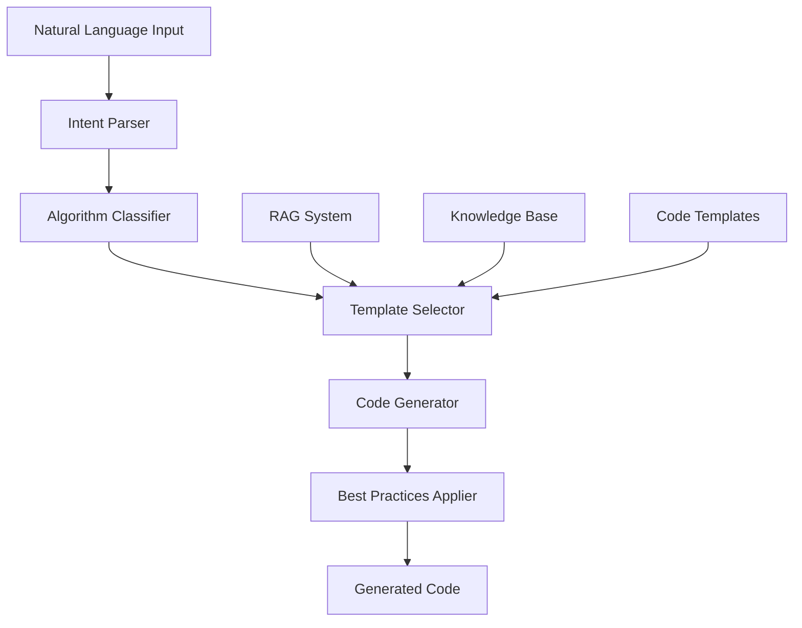

# Designer Agent

## 🎯 Overview

The Designer Agent is the primary code generation component of the Cirq-RAG-Code-Assistant system. It transforms natural language descriptions into syntactically correct, executable Cirq quantum computing code.

## 🧠 Core Responsibilities

### Primary Functions
1. **Natural Language Processing**: Parse and understand user requirements
2. **Code Generation**: Create Cirq code from high-level descriptions
3. **Template Management**: Select and customize appropriate code templates
4. **Algorithm Implementation**: Generate specific quantum algorithms
5. **Best Practices**: Apply Cirq coding standards and conventions

### Supported Algorithms
- **VQE** (Variational Quantum Eigensolver)
- **QAOA** (Quantum Approximate Optimization Algorithm)
- **Grover's Search Algorithm**
- **Quantum Fourier Transform (QFT)**
- **Quantum Teleportation**
- **Custom Quantum Circuits**

## 🏗️ Architecture



## 🔧 Implementation Details

### Core Components

#### 1. Intent Parser
```python
class IntentParser:
    """Parses natural language input to extract programming intent."""
    
    def __init__(self):
        self.nlp_model = load_nlp_model()
        self.intent_classifier = IntentClassifier()
        self.entity_extractor = EntityExtractor()
    
    def parse_intent(self, user_input: str) -> ParsedIntent:
        """
        Parse user input to extract:
        - Algorithm type
        - Parameters and constraints
        - Specific requirements
        - Complexity level
        """
        # 1. Tokenize and analyze input
        tokens = self.nlp_model.tokenize(user_input)
        
        # 2. Classify intent
        intent = self.intent_classifier.classify(tokens)
        
        # 3. Extract entities
        entities = self.entity_extractor.extract(tokens)
        
        # 4. Build structured intent
        return ParsedIntent(intent, entities, user_input)
```

#### 2. Algorithm Classifier
```python
class AlgorithmClassifier:
    """Classifies user intent into specific quantum algorithms."""
    
    def __init__(self):
        self.algorithm_patterns = {
            'vqe': ['variational', 'eigensolver', 'ground state', 'energy'],
            'qaoa': ['optimization', 'maxcut', 'tsp', 'combinatorial'],
            'grover': ['search', 'database', 'amplitude amplification'],
            'qft': ['fourier transform', 'period finding', 'shor'],
            'teleportation': ['teleport', 'quantum state', 'communication']
        }
    
    def classify_algorithm(self, intent: ParsedIntent) -> str:
        """Classify the intended quantum algorithm."""
        # 1. Match against known patterns
        # 2. Use ML model for complex cases
        # 3. Return algorithm type or 'custom'
```

#### 3. Template Selector
```python
class TemplateSelector:
    """Selects appropriate code templates based on algorithm and requirements."""
    
    def __init__(self):
        self.template_db = TemplateDatabase()
        self.rag_system = RAGSystem()
    
    def select_template(self, algorithm: str, requirements: dict) -> CodeTemplate:
        """
        Select the best template based on:
        - Algorithm type
        - Complexity level
        - Specific requirements
        - User preferences
        """
        # 1. Query template database
        # 2. Use RAG for context-aware selection
        # 3. Rank templates by relevance
        # 4. Return best match
```

#### 4. Code Generator
```python
class CodeGenerator:
    """Generates Cirq code from templates and requirements."""
    
    def __init__(self):
        self.template_engine = TemplateEngine()
        self.cirq_generator = CirqCodeGenerator()
        self.import_manager = ImportManager()
    
    def generate_code(self, template: CodeTemplate, params: dict) -> GeneratedCode:
        """
        Generate code by:
        1. Filling template parameters
        2. Adding necessary imports
        3. Applying Cirq best practices
        4. Ensuring syntax correctness
        """
        # 1. Process template
        code = self.template_engine.process(template, params)
        
        # 2. Add imports
        imports = self.import_manager.get_imports(code)
        
        # 3. Apply best practices
        optimized_code = self.cirq_generator.optimize(code)
        
        # 4. Validate syntax
        self.validate_syntax(optimized_code)
        
        return GeneratedCode(optimized_code, imports, metadata)
```

## 📋 Code Generation Process

### Step-by-Step Workflow

1. **Input Analysis**
   ```python
   # Example input: "Create a VQE circuit for H2 molecule with 4 qubits"
   parsed_intent = {
       'algorithm': 'vqe',
       'molecule': 'H2',
       'qubits': 4,
       'complexity': 'intermediate'
   }
   ```

2. **Template Selection**
   ```python
   # Select appropriate VQE template
   template = template_selector.select_template('vqe', {
       'molecule_type': 'H2',
       'qubit_count': 4,
       'optimization_level': 'intermediate'
   })
   ```

3. **Parameter Filling**
   ```python
   # Fill template with specific parameters
   parameters = {
       'num_qubits': 4,
       'num_layers': 2,
       'molecule': 'H2',
       'optimizer': 'COBYLA'
   }
   ```

4. **Code Generation**
   ```python
   # Generate final code
   generated_code = code_generator.generate_code(template, parameters)
   ```

### Example Generated Code

```python
import cirq
import numpy as np
from scipy.optimize import minimize

def create_h2_vqe_circuit(num_qubits: int = 4, num_layers: int = 2) -> cirq.Circuit:
    """
    Create a VQE circuit for H2 molecule optimization.
    
    Args:
        num_qubits: Number of qubits in the circuit
        num_layers: Number of variational layers
    
    Returns:
        Parameterized Cirq circuit for VQE
    """
    # Create qubits
    qubits = cirq.LineQubit.range(num_qubits)
    
    # Initialize circuit
    circuit = cirq.Circuit()
    
    # Add variational layers
    for layer in range(num_layers):
        # Add parameterized rotations
        for i, qubit in enumerate(qubits):
            circuit.append(cirq.ry(cirq.Symbol(f'theta_{layer}_{i}'))(qubit))
        
        # Add entangling gates
        for i in range(num_qubits - 1):
            circuit.append(cirq.CNOT(qubits[i], qubits[i + 1]))
    
    return circuit

def vqe_cost_function(params: np.ndarray, circuit: cirq.Circuit) -> float:
    """Calculate the cost function for VQE optimization."""
    # Resolve parameters
    param_resolver = cirq.ParamResolver({
        param.name: params[i] 
        for i, param in enumerate(circuit.findall_operations_with_gate_type(cirq.Symbol))
    })
    
    # Simulate circuit
    simulator = cirq.Simulator()
    result = simulator.simulate(circuit, param_resolver=param_resolver)
    
    # Calculate expectation value (simplified)
    return np.real(result.final_state_vector[0])

# Example usage
if __name__ == "__main__":
    # Create circuit
    circuit = create_h2_vqe_circuit(num_qubits=4, num_layers=2)
    
    # Optimize parameters
    initial_params = np.random.random(8)  # 4 qubits * 2 layers
    result = minimize(vqe_cost_function, initial_params, args=(circuit,))
    
    print(f"Optimized parameters: {result.x}")
    print(f"Minimum energy: {result.fun}")
```

## 🎨 Code Templates

### Template Structure
```python
class CodeTemplate:
    """Represents a code template for algorithm generation."""
    
    def __init__(self, name: str, algorithm: str, template_code: str):
        self.name = name
        self.algorithm = algorithm
        self.template_code = template_code
        self.parameters = self.extract_parameters()
        self.imports = self.extract_imports()
        self.metadata = self.generate_metadata()
```

### Template Categories

#### 1. Algorithm Templates
- **VQE Templates**: Different molecular systems and optimization strategies
- **QAOA Templates**: Various optimization problems and graph structures
- **Grover Templates**: Different search spaces and oracle implementations
- **QFT Templates**: Various period-finding and phase estimation applications

#### 2. Complexity Templates
- **Beginner**: Simple, well-commented code with basic functionality
- **Intermediate**: More sophisticated implementations with optimization
- **Advanced**: Complex algorithms with advanced features and optimizations

#### 3. Hardware Templates
- **Simulator**: Optimized for classical simulation
- **NISQ Devices**: Optimized for noisy intermediate-scale quantum devices
- **Fault-Tolerant**: Designed for future fault-tolerant quantum computers

## 🔍 Quality Assurance

### Code Validation
```python
class CodeValidator:
    """Validates generated code for correctness and quality."""
    
    def validate_code(self, code: str) -> ValidationResult:
        """
        Validate code for:
        - Syntax correctness
        - Import resolution
        - Type consistency
        - Best practices compliance
        """
        # 1. Syntax validation
        syntax_valid = self.check_syntax(code)
        
        # 2. Import validation
        imports_valid = self.check_imports(code)
        
        # 3. Type checking
        types_valid = self.check_types(code)
        
        # 4. Best practices
        practices_valid = self.check_best_practices(code)
        
        return ValidationResult(
            syntax_valid, imports_valid, types_valid, practices_valid
        )
```

### Best Practices Enforcement
- **Naming Conventions**: Follow Python and Cirq naming standards
- **Documentation**: Include docstrings and comments
- **Error Handling**: Proper exception handling and validation
- **Performance**: Efficient algorithms and data structures
- **Modularity**: Reusable and well-structured code

## 📊 Performance Metrics

### Generation Metrics
- **Success Rate**: Percentage of successful code generations
- **Syntax Accuracy**: Percentage of syntactically correct code
- **Algorithm Coverage**: Number of supported algorithms
- **Template Utilization**: Effectiveness of different templates

### Quality Metrics
- **Code Complexity**: Cyclomatic complexity of generated code
- **Documentation Coverage**: Percentage of documented functions
- **Test Coverage**: Percentage of testable code paths
- **Performance Benchmarks**: Execution time and memory usage

## 🚀 Advanced Features

### Adaptive Learning
- **User Feedback Integration**: Learn from user corrections and preferences
- **Pattern Recognition**: Identify common patterns in user requests
- **Template Evolution**: Improve templates based on usage patterns
- **Personalization**: Adapt to individual user styles and preferences

### Multi-Language Support
- **Natural Language Variants**: Support for different languages and dialects
- **Technical Terminology**: Handle domain-specific quantum computing terms
- **Context Awareness**: Understand context from previous interactions
- **Ambiguity Resolution**: Handle ambiguous or incomplete requests

## 🔧 Configuration

### Agent Settings
```yaml
designer_agent:
  max_code_length: 1000
  template_confidence_threshold: 0.8
  algorithm_support:
    - vqe
    - qaoa
    - grover
    - qft
    - teleportation
  code_style:
    line_length: 88
    docstring_style: "google"
    import_order: "isort"
  validation:
    syntax_check: true
    type_check: true
    best_practices: true
```

### Template Configuration
```yaml
templates:
  vqe:
    default_layers: 2
    default_optimizer: "COBYLA"
    supported_molecules: ["H2", "LiH", "BeH2"]
  qaoa:
    default_p: 1
    default_graph_type: "random"
    supported_problems: ["maxcut", "tsp", "graph_coloring"]
```

## 🧪 Testing

### Unit Tests
```python
class TestDesignerAgent:
    """Test suite for Designer Agent functionality."""
    
    def test_vqe_generation(self):
        """Test VQE circuit generation."""
        agent = DesignerAgent()
        result = agent.generate_code("Create a VQE circuit for H2")
        assert result.algorithm == "vqe"
        assert result.syntax_valid
        assert "cirq" in result.imports
    
    def test_parameter_handling(self):
        """Test parameter extraction and handling."""
        agent = DesignerAgent()
        params = agent.extract_parameters("4 qubits, 3 layers")
        assert params["qubits"] == 4
        assert params["layers"] == 3
```

### Integration Tests
- **End-to-End Generation**: Complete workflow testing
- **Template Integration**: Template selection and application
- **RAG Integration**: Knowledge base interaction
- **Agent Communication**: Inter-agent message passing

---

*For related documentation, see [Optimizer Agent](optimizer.md), [Validator Agent](validator.md), and [Educational Agent](educational.md).*
