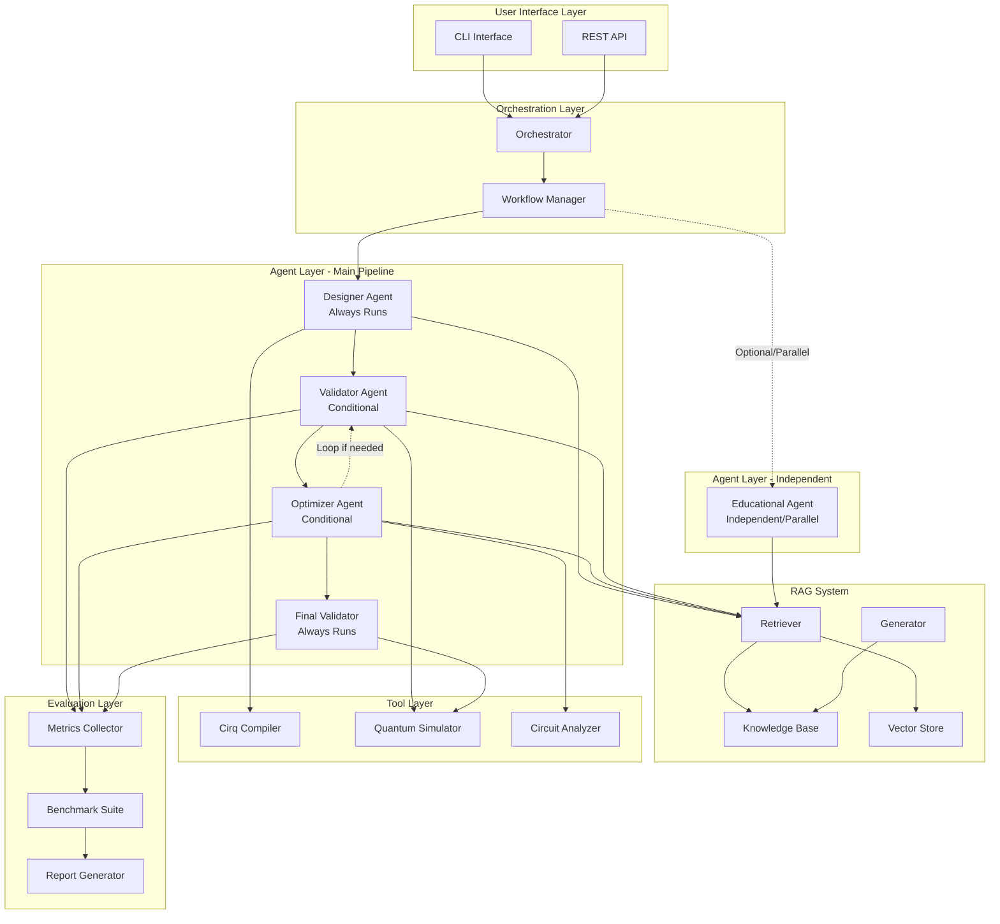

# System Architecture

## 🏗️ High-Level Architecture

The Cirq-RAG-Code-Assistant employs a sophisticated multi-layered architecture that combines Retrieval-Augmented Generation (RAG) with a multi-agent orchestration system.



## 🧩 Component Details

### 1. User Interface Layer

#### CLI Interface
- **Purpose**: Command-line interface for direct interaction
- **Features**: 
  - Natural language input processing
  - Interactive mode with step-by-step guidance
  - Batch processing capabilities
  - Configuration management

#### REST API
- **Purpose**: Programmatic access for integration
- **Features**:
  - RESTful endpoints for all operations
  - JSON request/response format
  - Authentication and rate limiting
  - WebSocket support for real-time updates

### 2. Orchestration Layer

#### Orchestrator
- **Responsibilities**:
  - Request routing and load balancing
  - Agent coordination and communication
  - Error handling and recovery
  - Performance monitoring

#### Workflow Manager
- **Responsibilities**:
  - Multi-step process coordination
  - State management across agents
  - Parallel execution optimization
  - Result aggregation and formatting

### 3. Agent Layer

#### Designer Agent
```python
class DesignerAgent:
    """Generates initial Cirq code from natural language descriptions."""
    
    def __init__(self):
        self.rag_system = RAGSystem()
        self.code_templates = CodeTemplateManager()
        self.cirq_knowledge = CirqKnowledgeBase()
    
    def generate_code(self, description: str) -> GeneratedCode:
        # 1. Parse natural language input
        # 2. Retrieve relevant examples from RAG
        # 3. Generate initial code structure
        # 4. Apply Cirq best practices
        # 5. Return structured code with metadata
```

#### Optimizer Agent
```python
class OptimizerAgent:
    """Optimizes quantum circuits for performance and efficiency."""
    
    def __init__(self):
        self.optimization_rules = OptimizationRuleEngine()
        self.performance_analyzer = CircuitAnalyzer()
        self.gate_reduction = GateReductionEngine()
    
    def optimize_circuit(self, circuit: cirq.Circuit) -> OptimizedCircuit:
        # 1. Analyze circuit structure and metrics
        # 2. Apply optimization rules
        # 3. Reduce gate count and depth
        # 4. Validate optimization results
        # 5. Return optimized circuit with metrics
```

#### Validator Agent
```python
class ValidatorAgent:
    """Validates generated code through compilation and simulation."""
    
    def __init__(self):
        self.compiler = CirqCompiler()
        self.simulator = QuantumSimulator()
        self.test_suite = TestSuite()
    
    def validate_code(self, code: str) -> ValidationResult:
        # 1. Syntax validation
        # 2. Compilation testing
        # 3. Simulation execution
        # 4. Result verification
        # 5. Performance benchmarking
```

#### Educational Agent
```python
class EducationalAgent:
    """Provides educational explanations and learning materials."""
    
    def __init__(self):
        self.explanation_engine = ExplanationEngine()
        self.visualization = CircuitVisualizer()
        self.learning_materials = LearningMaterialDB()
    
    def generate_explanation(self, code: str, context: str) -> EducationalContent:
        # 1. Analyze code structure and operations
        # 2. Generate step-by-step explanations
        # 3. Create visual representations
        # 4. Provide learning resources
        # 5. Return comprehensive educational content
```

### 4. RAG System

#### Knowledge Base Structure
```
knowledge_base/
├── code_snippets/
│   ├── algorithms/
│   │   ├── vqe/
│   │   ├── qaoa/
│   │   ├── grover/
│   │   └── qft/
│   ├── patterns/
│   │   ├── gates/
│   │   ├── measurements/
│   │   └── optimization/
│   └── examples/
├── explanations/
│   ├── concepts/
│   ├── tutorials/
│   └── best_practices/
└── metadata/
    ├── embeddings/
    ├── indices/
    └── schemas/
```

#### Vector Store
- **Technology**: FAISS (Facebook AI Similarity Search)
- **Embeddings**: Sentence Transformers (all-MiniLM-L6-v2)
- **Indexing**: Hierarchical Navigable Small World (HNSW)
- **Search**: Semantic similarity with configurable thresholds

### 5. Tool Layer

#### Cirq Compiler
- **Purpose**: Real-time code compilation and validation
- **Features**:
  - Syntax checking
  - Import resolution
  - Dependency validation
  - Error reporting with suggestions

#### Quantum Simulator
- **Purpose**: Circuit simulation and testing
- **Features**:
  - State vector simulation
  - Measurement result generation
  - Noise modeling
  - Performance profiling

#### Circuit Analyzer
- **Purpose**: Circuit analysis and optimization
- **Features**:
  - Gate count analysis
  - Depth calculation
  - Connectivity analysis
  - Optimization suggestions

### 6. Evaluation Layer

#### Metrics Collection
- **Code Quality Metrics**:
  - Syntax correctness rate
  - Compilation success rate
  - Execution success rate
  - Performance benchmarks

- **Educational Metrics**:
  - Explanation quality scores
  - Learning effectiveness measures
  - User satisfaction ratings
  - Knowledge retention rates

#### Benchmark Suite
- **Standard Algorithms**: VQE, QAOA, Grover, QFT
- **Performance Tests**: Circuit optimization benchmarks
- **Educational Tests**: Learning outcome assessments
- **Integration Tests**: End-to-end workflow validation

## 🔄 Data Flow

### 1. Request Processing Flow
```mermaid
sequenceDiagram
    participant U as User
    participant O as Orchestrator
    participant D as Designer Agent
    participant R as RAG System
    participant V as Validator Agent
    participant Opt as Optimizer Agent
    participant FV as Final Validator
    participant E as Educational Agent
    
    U->>O: Natural language request (with options)
    
    Note over O,D: Designer Always Runs
    O->>D: Generate code request
    D->>R: Retrieve relevant examples
    R-->>D: Context and examples
    D-->>O: Generated code
    
    alt Validation Enabled
        O->>V: Validate code
        V-->>O: Validation results
    end
    
    alt Optimization Enabled
        O->>Opt: Optimize circuit
        Opt-->>O: Optimized code
        
        loop Re-validation if needed
            O->>V: Re-validate optimized code
            V-->>O: Validation results
            O->>Opt: Re-optimize based on feedback
            Opt-->>O: Updated code
        end
    end
    
    Note over O,FV: Final Validator Always Runs
    O->>FV: Final validation
    FV-->>O: Final validation results
    
    O-->>U: Complete response with code
    
    Note over E: Educational Agent (Independent)
    alt Educational Mode Enabled
        O->>E: Generate explanations (parallel)
        E-->>O: Educational content
        O-->>U: Explanations for user prompt
    end
```

### 2. Agent Pipeline Pattern
The system follows a **sequential pipeline with conditional stages**:

```
Designer (Always) → [Validator] → [Optimizer ⟷ Validator Loop] → Final Validator (Always)
                                        
Educational Agent runs independently, focused on user prompt explanations
```

### 3. Agent Communication Pattern
- **Sequential Pipeline**: Main agents process in defined order
- **Conditional Stages**: Validator and Optimizer can be enabled/disabled
- **Iterative Loop**: Optimizer can request re-validation for improvements
- **Parallel Processing**: Educational Agent runs independently when requested
- **Shared Context**: Common context object passed between pipeline agents
- **Error Propagation**: Failures are handled gracefully with fallback options

## 🛡️ Security & Reliability

### Security Measures
- **Input Validation**: All user inputs are sanitized and validated
- **Code Sandboxing**: Generated code runs in isolated environments
- **Access Control**: Role-based access for different user types
- **Audit Logging**: Complete audit trail of all operations

### Reliability Features
- **Fault Tolerance**: System continues operating despite component failures
- **Graceful Degradation**: Reduced functionality when components are unavailable
- **Health Monitoring**: Continuous monitoring of system health
- **Automatic Recovery**: Self-healing capabilities for common issues

## 📈 Scalability Considerations

### Horizontal Scaling
- **Agent Scaling**: Multiple instances of each agent type
- **Load Balancing**: Intelligent request distribution
- **Caching**: Multi-level caching for improved performance
- **Database Sharding**: Distributed knowledge base storage

### Performance Optimization
- **Async Processing**: Non-blocking operations where possible
- **Connection Pooling**: Efficient database and service connections
- **Memory Management**: Optimized memory usage and garbage collection
- **CPU Optimization**: Parallel processing and vectorization

## 🔧 Configuration Management

### Environment Configuration
```yaml
# config.yaml
system:
  agents:
    designer:
      max_retries: 3
      timeout: 30
    optimizer:
      optimization_level: "aggressive"
    validator:
      simulation_timeout: 60
  rag:
    vector_store:
      index_type: "hnsw"
      similarity_threshold: 0.7
    knowledge_base:
      update_interval: 3600
```

### Feature Flags
- **Experimental Features**: Gradual rollout of new capabilities
- **Performance Tuning**: Runtime configuration adjustments
- **Debugging**: Enhanced logging and monitoring options
- **A/B Testing**: Feature comparison and optimization

---

*For implementation details, see the individual component documentation in the [agents](agents/README.md), [rag](rag/README.md), and [orchestration](orchestration/README.md) sections.*
