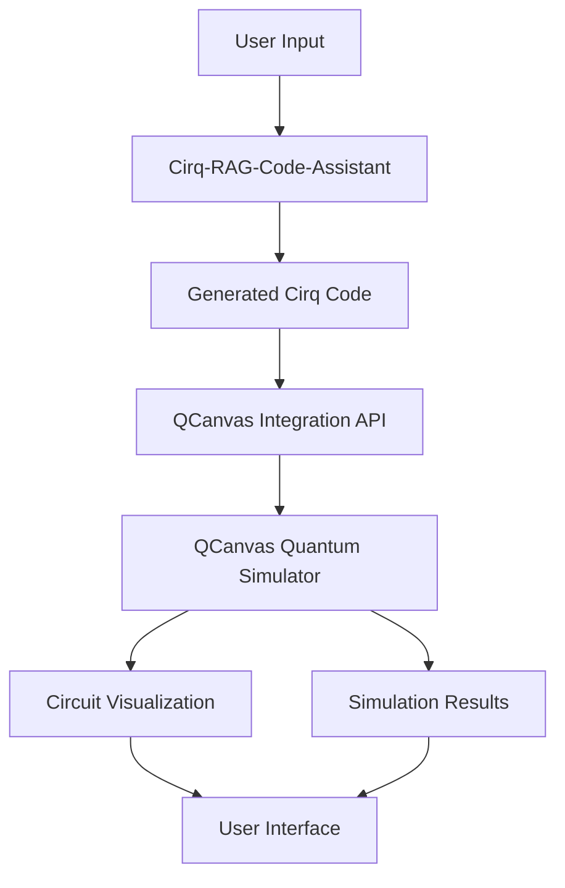

# QCanvas Integration Guide

## 🎯 Overview

**Note: This is a future enhancement that will be implemented after the core research project is completed.**

This guide explains how to integrate the Cirq-RAG-Code-Assistant with your existing QCanvas quantum simulator for real-time circuit visualization and execution. This integration is planned as an additional feature to be developed after the main research objectives are achieved.

## 🏗️ Integration Architecture



## 🔧 Integration Components

### 1. QCanvas Integration API

The integration layer provides a bridge between the Cirq-RAG-Code-Assistant and QCanvas:

```python
from cirq_rag_code_assistant.integration import QCanvasClient

class QCanvasIntegration:
    """Integration with QCanvas quantum simulator."""
    
    def __init__(self, qcanvas_host: str, qcanvas_port: int):
        self.client = QCanvasClient(host=qcanvas_host, port=qcanvas_port)
    
    def visualize_circuit(self, cirq_circuit: cirq.Circuit) -> str:
        """Send circuit to QCanvas for visualization."""
        return self.client.visualize_circuit(cirq_circuit)
    
    def simulate_circuit(self, cirq_circuit: cirq.Circuit) -> dict:
        """Run simulation on QCanvas."""
        return self.client.simulate_circuit(cirq_circuit)
    
    def get_circuit_metrics(self, cirq_circuit: cirq.Circuit) -> dict:
        """Get circuit analysis from QCanvas."""
        return self.client.analyze_circuit(cirq_circuit)
```

### 2. Real-time Communication

The system uses WebSocket connections for real-time updates:

```python
import asyncio
import websockets
import json

class QCanvasWebSocketClient:
    """WebSocket client for real-time QCanvas communication."""
    
    async def connect(self, uri: str):
        """Connect to QCanvas WebSocket."""
        self.websocket = await websockets.connect(uri)
    
    async def send_circuit_update(self, circuit_data: dict):
        """Send circuit updates to QCanvas."""
        await self.websocket.send(json.dumps({
            "type": "circuit_update",
            "data": circuit_data
        }))
    
    async def receive_simulation_results(self):
        """Receive simulation results from QCanvas."""
        message = await self.websocket.recv()
        return json.loads(message)
```

## 🚀 Setup Instructions

### 1. QCanvas Configuration

Configure QCanvas to accept connections from the Cirq-RAG-Code-Assistant:

```javascript
// QCanvas configuration
const qcanvasConfig = {
    port: 3000,
    cors: {
        origin: "http://localhost:8000", // Cirq-RAG-Code-Assistant server
        credentials: true
    },
    websocket: {
        enabled: true,
        path: "/ws"
    }
};
```

### 2. Environment Variables

Set up environment variables for QCanvas integration:

```bash
# QCanvas Integration
QCANVAS_HOST=localhost
QCANVAS_PORT=3000
QCANVAS_API_KEY=your_qcanvas_api_key
QCANVAS_WEBSOCKET_URL=ws://localhost:3000/ws

# Cirq-RAG-Code-Assistant
CIRQ_RAG_HOST=0.0.0.0
CIRQ_RAG_PORT=8000
```

### 3. Installation

Install the QCanvas integration dependencies:

```bash
pip install -e ".[qcanvas]"
```

## 📡 API Endpoints

### QCanvas Integration Endpoints

#### POST /api/v1/qcanvas/visualize
Send a Cirq circuit to QCanvas for visualization.

**Request:**
```json
{
    "circuit": "import cirq\nqubits = cirq.LineQubit.range(2)\ncircuit = cirq.Circuit()\ncircuit.append(cirq.H(qubits[0]))\ncircuit.append(cirq.CNOT(qubits[0], qubits[1]))",
    "options": {
        "show_measurements": true,
        "gate_labels": true
    }
}
```

**Response:**
```json
{
    "success": true,
    "visualization_url": "http://localhost:3000/circuit/12345",
    "circuit_id": "12345"
}
```

#### POST /api/v1/qcanvas/simulate
Run simulation on QCanvas.

**Request:**
```json
{
    "circuit_id": "12345",
    "simulation_options": {
        "shots": 1000,
        "noise_model": "depolarizing"
    }
}
```

**Response:**
```json
{
    "success": true,
    "results": {
        "counts": {"00": 500, "11": 500},
        "state_vector": [0.707, 0.0, 0.0, 0.707],
        "execution_time": "0.05s"
    }
}
```

#### GET /api/v1/qcanvas/circuit/{circuit_id}/metrics
Get circuit analysis metrics from QCanvas.

**Response:**
```json
{
    "success": true,
    "metrics": {
        "depth": 2,
        "gate_count": 2,
        "two_qubit_gates": 1,
        "connectivity": "linear",
        "estimated_time": "2.5ms"
    }
}
```

## 🔄 Workflow Integration

### 1. Code Generation with QCanvas Visualization

```python
from cirq_rag_code_assistant import Orchestrator
from cirq_rag_code_assistant.integration import QCanvasIntegration

# Initialize components
orchestrator = Orchestrator()
qcanvas = QCanvasIntegration("localhost", 3000)

# Generate code
result = orchestrator.generate_code(
    description="Create a VQE circuit for H2 molecule",
    algorithm="vqe",
    parameters={"qubits": 4, "layers": 2}
)

# Send to QCanvas for visualization
visualization_url = qcanvas.visualize_circuit(result.code)
print(f"Circuit visualization: {visualization_url}")

# Run simulation
simulation_results = qcanvas.simulate_circuit(result.code)
print(f"Simulation results: {simulation_results}")
```

### 2. Real-time Updates

```python
import asyncio

async def real_time_workflow():
    """Example of real-time QCanvas integration."""
    
    # Connect to QCanvas WebSocket
    qcanvas_ws = QCanvasWebSocketClient()
    await qcanvas_ws.connect("ws://localhost:3000/ws")
    
    # Generate and send circuit
    circuit = generate_vqe_circuit()
    await qcanvas_ws.send_circuit_update({
        "circuit": circuit,
        "type": "vqe",
        "parameters": {"qubits": 4}
    })
    
    # Receive simulation results
    results = await qcanvas_ws.receive_simulation_results()
    print(f"Real-time results: {results}")

# Run the workflow
asyncio.run(real_time_workflow())
```

## 🧪 Testing Integration

### 1. Test QCanvas Connection

```python
def test_qcanvas_connection():
    """Test connection to QCanvas."""
    qcanvas = QCanvasIntegration("localhost", 3000)
    
    # Test basic connection
    assert qcanvas.client.ping() == "pong"
    
    # Test circuit visualization
    test_circuit = cirq.Circuit(cirq.H(cirq.LineQubit(0)))
    result = qcanvas.visualize_circuit(test_circuit)
    assert result["success"] == True
```

### 2. Integration Tests

```python
def test_end_to_end_integration():
    """Test complete workflow with QCanvas."""
    
    # Generate code
    result = orchestrator.generate_code("Create a simple VQE circuit")
    
    # Send to QCanvas
    qcanvas = QCanvasIntegration("localhost", 3000)
    viz_result = qcanvas.visualize_circuit(result.code)
    
    # Verify visualization
    assert viz_result["success"] == True
    assert "visualization_url" in viz_result
    
    # Run simulation
    sim_result = qcanvas.simulate_circuit(result.code)
    assert sim_result["success"] == True
    assert "results" in sim_result
```

## 🔧 Configuration

### QCanvas Integration Settings

```yaml
# config/qcanvas.yaml
qcanvas:
  host: "localhost"
  port: 3000
  api_key: "your_api_key_here"
  websocket:
    enabled: true
    url: "ws://localhost:3000/ws"
    reconnect_attempts: 5
    reconnect_delay: 1.0
  
  visualization:
    default_style: "modern"
    show_gate_labels: true
    show_measurements: true
    color_scheme: "quantum"
  
  simulation:
    default_shots: 1000
    timeout: 30
    noise_models: ["depolarizing", "amplitude_damping"]
```

## 🚨 Troubleshooting

### Common Issues

#### 1. Connection Refused
```
Error: Connection refused to QCanvas at localhost:3000
```
**Solution**: Ensure QCanvas is running and accessible on the specified port.

#### 2. WebSocket Connection Failed
```
Error: WebSocket connection failed
```
**Solution**: Check QCanvas WebSocket configuration and firewall settings.

#### 3. Circuit Visualization Failed
```
Error: Circuit visualization failed
```
**Solution**: Verify circuit format and QCanvas visualization API compatibility.

### Debug Mode

Enable debug logging for QCanvas integration:

```bash
export CIRQ_RAG_DEBUG=true
export QCANVAS_DEBUG=true
cirq-rag server --log-level debug
```

## 📚 Examples

### Complete Integration Example

```python
#!/usr/bin/env python3
"""
Complete example of Cirq-RAG-Code-Assistant with QCanvas integration.
"""

import asyncio
from cirq_rag_code_assistant import Orchestrator
from cirq_rag_code_assistant.integration import QCanvasIntegration

async def main():
    # Initialize components
    orchestrator = Orchestrator()
    qcanvas = QCanvasIntegration("localhost", 3000)
    
    # Generate VQE circuit
    print("Generating VQE circuit...")
    result = orchestrator.generate_code(
        description="Create a VQE circuit for H2 molecule with 4 qubits",
        algorithm="vqe",
        parameters={"qubits": 4, "layers": 2}
    )
    
    print(f"Generated code:\n{result.code}")
    print(f"Explanation:\n{result.explanation}")
    
    # Visualize in QCanvas
    print("Sending to QCanvas for visualization...")
    viz_result = qcanvas.visualize_circuit(result.code)
    print(f"Visualization URL: {viz_result['visualization_url']}")
    
    # Run simulation
    print("Running simulation...")
    sim_result = qcanvas.simulate_circuit(result.code)
    print(f"Simulation results: {sim_result['results']}")
    
    # Get circuit metrics
    print("Getting circuit metrics...")
    metrics = qcanvas.get_circuit_metrics(result.code)
    print(f"Circuit metrics: {metrics}")

if __name__ == "__main__":
    asyncio.run(main())
```

---

*For more information, see the [API Documentation](api/README.md) and [Quick Start Guide](quickstart.md).*
