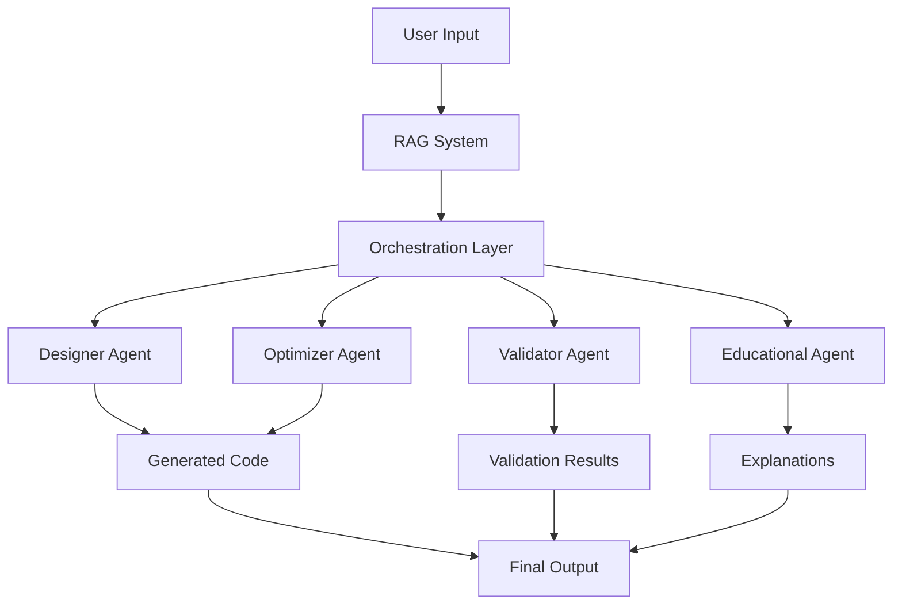

# Project Overview

## 🎯 Mission Statement

The Cirq-RAG-Code-Assistant is a research-grade system designed to integrate with QCanvas quantum simulator, providing intelligent code generation and educational support for Google's Cirq quantum computing framework with GPU optimization.

## 🚀 Core Objectives

### Primary Goals
1. **QCanvas Integration**: Seamlessly integrate with existing QCanvas quantum simulator
2. **Educational Excellence**: Provide step-by-step explanations alongside generated code
3. **Code Quality**: Generate syntactically correct, executable Cirq code
4. **GPU Optimization**: Leverage TensorFlow GPU for performance optimization
5. **Validation & Testing**: Ensure generated code works through simulation and testing

### Target Users
- **QCanvas Users** integrating with existing quantum simulator
- **Students** learning quantum computing and Cirq programming
- **Researchers** prototyping quantum algorithms and circuits
- **Educators** teaching quantum computing concepts

## 🏗️ System Architecture

The system employs a hybrid **Retrieval-Augmented Generation (RAG) + Multi-Agent** architecture:

## 🧠 Key Components

### 1. RAG System
- **Knowledge Base**: Curated Cirq code snippets, natural language descriptions, and educational explanations
- **Vector Search**: Semantic similarity matching using sentence transformers
- **Context Retrieval**: Relevant examples and patterns for code generation

### 2. Multi-Agent System
- **Designer Agent**: Generates initial Cirq code from natural language
- **Optimizer Agent**: Improves circuit efficiency and reduces gate count
- **Validator Agent**: Tests and validates generated code
- **Educational Agent**: Provides explanations and learning materials

### 3. Tool Integration
- **Compilation Tools**: Real-time Cirq code compilation
- **Simulation Tools**: Quantum circuit simulation and testing
- **Analysis Tools**: Circuit depth, gate count, and performance metrics

## 🎓 Educational Features

### Learning Support
- **Step-by-step explanations** of quantum concepts
- **Code comments** explaining each operation
- **Visual representations** of quantum circuits
- **Interactive examples** for common algorithms

### Supported Algorithms
- **VQE** (Variational Quantum Eigensolver)
- **QAOA** (Quantum Approximate Optimization Algorithm)
- **Quantum Teleportation**
- **Grover's Search Algorithm**
- **Quantum Fourier Transform (QFT)**
- **Custom quantum circuits**

## 🔬 Research Applications

### Evaluation Metrics
- **Syntax Correctness**: Generated code compiles without errors
- **Execution Success**: Code runs and produces expected results
- **Educational Value**: Quality of explanations and learning materials
- **Performance Optimization**: Circuit efficiency improvements

### Benchmarking
- **Standard Test Cases**: Common quantum algorithms and patterns
- **Performance Baselines**: Comparison with hand-written code
- **Educational Effectiveness**: Learning outcome measurements

## 🛠️ Technical Innovation

### Hybrid Approach
- Combines the power of RAG for context-aware generation
- Leverages multi-agent systems for specialized tasks
- Integrates real-time validation and optimization

### Tool-Augmented Reasoning
- Agents can use external tools (compilers, simulators)
- Feedback loops for iterative improvement
- Real-time error detection and correction

## 📊 Success Metrics

### Technical Metrics
- **Code Generation Accuracy**: >95% syntactically correct code
- **Execution Success Rate**: >90% of generated code runs successfully
- **Optimization Improvement**: Average 20% reduction in circuit depth

### Educational Metrics
- **Learning Effectiveness**: Improved understanding of quantum concepts
- **User Satisfaction**: High ratings for explanations and usability
- **Adoption Rate**: Growing usage in academic and research communities

## 🔮 Future Vision

### Short-term Goals
- Expand algorithm coverage
- Improve optimization techniques
- Enhanced educational features

### Long-term Vision
- Support for multiple quantum frameworks
- Advanced visualization capabilities
- Integration with quantum hardware
- Community-driven knowledge base expansion

## 📄 License

This project is licensed under the Academic Use License - see the [LICENSE](../LICENSE) file for details. Commercial use requires explicit permission.

## 🤝 Contributing

We welcome contributions from the academic and research community. Please see our [Contributing Guide](contributing.md) for details on how to get involved.

---

*For technical details, see the [Architecture Guide](architecture.md). For getting started, see the [Quick Start Guide](quickstart.md).*
